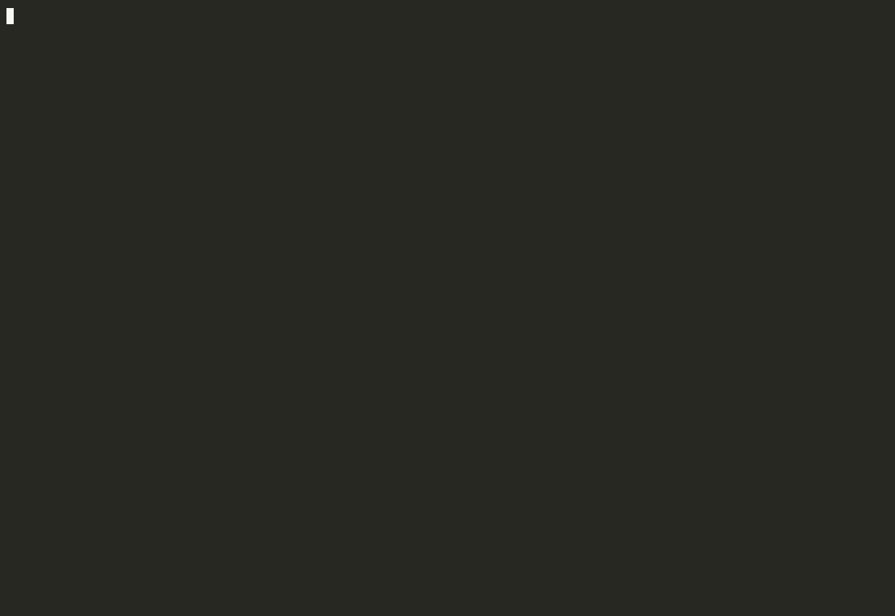

# helixgen

helixgen is **two things in one repo**:

1. A **Python CLI** that generates Line 6 Helix `.hsp` (Stadium) and `.hlx` (legacy) preset files from a strict JSON tone spec, and builds up a reusable library of block schemas by ingesting real exports.
2. A **Claude Code skill** at `.claude/skills/tone/` that drives the CLI from natural-language tone descriptions ("make me a Plexi crunch for my Strat verses, push it for the lead") — it clarifies, surveys the library, drafts the spec, runs the generator, and reports back with guitar-side settings.

You can use either piece on its own. The skill is the easier surface; the CLI is what you reach for if you want to tweak specs by hand or wire helixgen into other tooling.

There are three usage modes — bare CLI, local Claude Code with an auto-spawned MCP server, and a hosted MCP deploy on Render that integrates with claude.ai. They share the same library, spec, and output; they differ in driver and persistence. See [`docs/usage-modes.md`](docs/usage-modes.md) for a side-by-side and when to pick which.



> ⚠️ **Unofficial tool — use at your own risk.** Not affiliated with or endorsed by Line 6 / Yamaha (see the [Trademark notice](#trademark-notice) below). helixgen produces preset files that you import via HX Edit; loading any user-generated preset on your hardware carries non-zero risk — rejected loads, corrupted preset slots, on-device crashes, or other behavior we haven't seen. Review what you import. The MIT license under which helixgen is distributed disclaims all warranty; see [LICENSE](LICENSE).

## Install

```bash
git clone https://github.com/sheax0r/helixgen
cd helixgen
python -m venv .venv && source .venv/bin/activate
pip install -e ".[dev]"
```

## Quickstart

### A. With Claude Code (recommended)

Open this repo in Claude Code, seed the library once (step 1 below), then type something like:

> `/tone Les Paul with stock humbuckers, classic rock / hard rock. Make me one preset with three snapshots: a clean intro, a Plexi crunch for verses, and a singing lead for solos — Slash / Joe Bonamassa territory.`

A good prompt usually includes (a) your guitar (model and pickup type are most useful), (b) the musical style or a band/song reference, and (c) the role(s) you need. The skill will ask you for anything missing.

What the skill does: drafts a spec, runs `helixgen generate`, and reports back with the chain, your guitar-side knob/selector settings, the file path, and one suggested tweak after you load it. Multi-part requests ("rhythm + lead", "verse + chorus + solo") are bundled into snapshots automatically; fundamentally different sounds get split into separate presets.

**Iterate on the tone.** Generation is the start, not the end. After you load the preset on your device, come back to the same Claude Code session and describe what's off — *"the lead is too compressed,"* *"verses are too dark, more sparkle,"* *"swap the delay for something shorter and slappier,"* *"clean snapshot needs a touch of room reverb."* Claude will adjust the spec, regenerate, and tell you what changed so you can A/B against the previous version. Same `.hsp` filename by default, so you just re-import.

### B. CLI directly

```bash
# 1. Seed the library — from your own exports (preferred for accuracy)
helixgen ingest ~/MyPresets/

# Or from the sensorium/phelix community catalog
helixgen bootstrap

# 2. Browse the library
helixgen list-blocks
helixgen list-blocks --category amp
helixgen show-block "Brit 2204"

# 3. Generate a preset
helixgen generate my-tone.json -o my-tone.hsp
```

### C. As a Claude Code plugin

If you'd rather use the `/tone` skill in *any* Claude Code session — not just inside a clone of this repo — install helixgen as a plugin:

```
/plugin marketplace add sheax0r/helixgen
/plugin install helixgen@helixgen
```

You'll still need `pip install helixgen` in the Python env Claude Code launches MCP servers under, because the bundled `helixgen` MCP server is a thin wrapper around the installed Python package.

## Spec format

A tone spec is a JSON document. Minimal example:

```json
{
  "name": "My Rhythm Tone",
  "paths": [
    {
      "blocks": [
        { "block": "Noise Gate", "params": { "Threshold": 0.4 } },
        { "block": "Brit 2204",  "params": { "Drive": 0.6, "Bass": 0.5 } },
        { "block": "4x12 Greenback 25" }
      ]
    }
  ]
}
```

- `name` is the preset name shown in HX Edit.
- `paths` contains 1 or 2 chains (mapping to dsp0 / dsp1).
- Each block has a `block` (display name or model_id) and optional `params` (wire values: 0–1 floats for amp gain, integer Hz for cut frequencies, strings for enums like mic types).

## Impulse Responses (IRs)

helixgen supports user IRs in Stadium presets — `With Pan` blocks (and the rest of the `HX2_ImpulseResponse*` family) can reference a `.wav` file by basename, and helixgen will resolve it to the 32-character `irhash` the device expects.

Stadium identifies user IRs by a content-derived hash, not by filename or slot. helixgen reproduces that hash bit-identically without any device round-trip, so you can register an entire IR library locally and reference IRs by name in your specs.

```bash
# 1. Cache hashes for an IR library in one pass (recurses; ~1 ms per IR after warm-up).
helixgen ir-scan ~/path/to/IRs/
helixgen list-irs | wc -l   # verify

# 2. Reference IRs by basename in a spec:
#   {"block": "With Pan",
#    "ir": "YA MRSH 412 T75 Mix 03.wav",
#    "params": {"HighCut": 6800, "LowCut": 90, "Mix": 1.0}}
helixgen generate my-tone.json -o my-tone.hsp
```

**Caveat:** for the `irhash` in a generated preset to actually resolve on the device, the matching WAV must also be loaded onto the device via the Helix Stadium app's **Librarian → Cab IRs → Import**. helixgen only handles the preset side; importing IRs onto the device is the Stadium app's job. If a slot displays "No Model" on the device after loading a preset, that IR wasn't imported.

**Limitations:**
- **48 kHz sources only** at the moment. Non-48 kHz raises a clear error with a `sox in.wav -r 48000 out.wav` suggestion. Stadium itself uses libsamplerate (`SRC_SINC_BEST_QUALITY`) for other rates; porting that bit-exactly is a separate project.
- Stereo input is reduced to the **left channel** (matches Stadium's own import behavior).

See [`docs/ir-hash-algorithm.md`](docs/ir-hash-algorithm.md) for the algorithm helixgen uses to compute the hash, including the load-bearing libsndfile detail and the field-validated reference implementation.

The CLI also provides `helixgen register-irs <preset.hsp> <wav1> <wav2> ...` — the original preset-binding form that predates the offline hash computation. Still the only way to register IRs that aren't 48 kHz, since for those you need to round-trip through a registration preset.

## Loading presets onto your device

helixgen produces files — it does **not** talk to the hardware directly. To get a generated preset onto your Stadium / Helix you go through Line 6's official desktop app.

**Default output location:**
- The `helixgen generate` CLI requires `-o <path>` — it writes wherever you point it; there is no default.
- The `/tone` Claude Code skill writes to `/tmp/<slug>.hsp` by default. Move it somewhere durable (e.g. `~/Documents/Helix Presets/`) before you reboot if you want to keep it.

**To load on the device:**

1. Connect your Stadium / Helix to your computer via USB.
2. Open Line 6's **HX Edit** application (or whichever Helix management app matches your device — check Line 6's downloads page if unsure).
3. Use the app's import / open command to load the `.hsp` (or `.hlx`) file.
4. Save the loaded preset to a slot on the device.

If HX Edit refuses to open the file, double-check that the chassis in your library matches your hardware (Stadium chassis → `.hsp`, legacy Helix chassis → `.hlx`).

Full design: `docs/superpowers/specs/2026-05-01-helix-preset-generator-design.md`.

## Library location

Default: `~/.helixgen/library/`. Override with `--library DIR` or `HELIXGEN_LIBRARY` env var.

## Limitations (v1)

- **Device validation:** `.hsp` output has been load-tested on a Helix **Stadium XL** and works. The non-XL **Helix Stadium** uses the same `.hsp` format and should work but is **untested** — the chassis baked into your library carries the device_id of whichever Stadium variant first exported a preset into it, so a chassis built from XL exports might or might not load cleanly on a non-XL Stadium. `.hlx` output is code-complete and round-trips through the parser and a real HX Edit export fixture, but has **never been loaded on a legacy Helix** (Floor / LT / Rack / Native) — treat it as plausibly-working-but-unverified until someone confirms.
- Single serial chain per DSP; no parallel A/B routing yet (see `docs/features/parallel-paths.md`).
- Wire values only — no display-value (0–10) translation.
- Output is not byte-identical to HX Edit's exports; it aims to load correctly.
- Footswitch assignment is not generated; assign on-device after loading.

## Acknowledgments

helixgen leans **heavily** on [**sensorium/phelix**](https://github.com/sensorium/phelix) — a community-maintained, hand-curated repository of Helix block JSON files. The `helixgen bootstrap` command clones phelix and ingests its `blocks/` directory; without that pre-extracted catalog the cold-start experience of this tool would be considerably worse.

## Trademark notice

helixgen is an unofficial community project. **Line 6**, **Helix**, **HX**, and related product names are trademarks of **Yamaha Guitar Group, Inc.** helixgen is not affiliated with, endorsed by, or sponsored by Line 6 or Yamaha. References in this project to Line 6 hardware, file formats (`.hlx`, `.hsp`), and model identifiers are descriptive — helixgen generates files intended to be compatible with Line 6 Helix devices but is not a Line 6 product.

If you are a representative of Line 6 / Yamaha and have concerns about this project's name or scope, please open an issue.

## Tests

```bash
pytest
```
